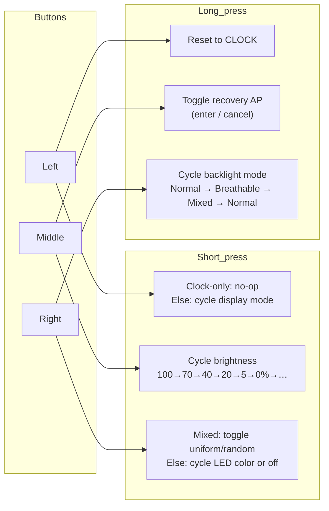
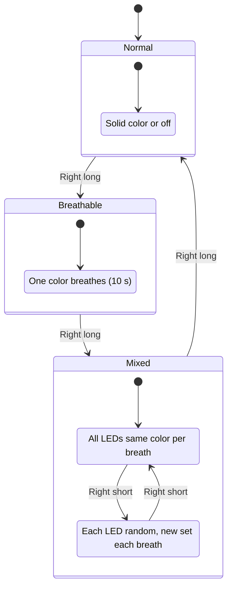

# Menu roadmap (button and backlight behavior)

Quick reference for the three capacitive touch buttons and backlight (strip LED) modes.

## Button overview

## Right button (strip LEDs)

| Action | Effect |
|--------|--------|
| **Short** | **Normal/Breathable:** Cycle color (warm orange → red → green → blue → cyan → magenta → amber → **off** → …). **Mixed:** Toggle uniform ↔ random (see below). |
| **Long** | Cycle **backlight mode**: Normal → Breathable → Mixed → Normal (logged to TTY). |

## Backlight modes (strip)

| Mode | Behavior |
|------|----------|
| **Normal** | Solid color at chosen level, or off. Middle button brightness applies to LCD only; strip follows short-press color/off. |
| **Breathable** | One chosen color breathes (0 → peak → 0 over 10 s). Short-press still cycles which color (or off); no flush from UI so breath timer drives strip. |
| **Mixed** | **Uniform (default):** One color for all 6 LEDs, rotating through the palette each breath. **Random:** Each LED gets a random color from the palette; the set of 6 colors is re-randomized every breath. Short-press right toggles uniform ↔ random. |

## Left and middle

- **Left short:** In clock-only build: no-op (stay on clock). Else: cycle display mode (CLOCK / WEATHER / DATE / …).
- **Left long:** Reset to CLOCK and refresh.
- **Middle short:** Cycle LCD brightness: 100% → 70% → 40% → 20% → 5% → 0% → 100% → …
- **Middle long:** Toggle recovery AP (`nowtube-setup`, open, 192.168.4.1). First long-press enters recovery mode; second long-press cancels and returns to normal. While active: each of the six displays shows one segment of the recovery instructions (`SETUP MODE` → `JOIN WI-FI` → `nowtube-setup` → `OPEN A BROWSER` → `GO TO:` → `192.168.4.1`), LEDs go solid dim blue, and LCD brightness is temporarily forced to 40% regardless of the user's saved setting (the saved value is restored on exit). Connect to `nowtube-setup`, open `http://192.168.4.1/`, enter credentials, and reboot.

## Diagram (backlight mode cycle)

## Recovery mode

### Purpose and scope

Recovery mode allows a user to (re)configure Wi-Fi credentials without a USB cable. It starts a standalone Wi-Fi access point (`nowtube-setup`) and serves the existing local config UI at `http://192.168.4.1/`. **There is no captive portal by design** — the user must manually open a browser to that address.

### Entry paths — both hardware-validated ✅

| Path | Trigger | Notes |
|------|---------|-------|
| **Live** | Middle button long-press (>1 s) | First long-press enters; second long-press cancels and restores normal mode |
| **Boot** | No SSID saved in NVS at startup | Device boots directly into recovery AP; no button press required |

### What happens on entry

1. Each of the 6 displays shows one segment of the recovery instructions (`SETUP MODE` → `JOIN WI-FI` → `nowtube-setup` → `OPEN A BROWSER` → `GO TO:` → `192.168.4.1`)
2. LEDs go solid dim blue
3. LCD brightness is temporarily forced to **40%** — regardless of the user's saved setting

### LCD brightness behavior

Recovery mode applies a **temporary 40% LCD brightness** override so the recovery instructions are always readable, regardless of the user's saved normal brightness setting (which may be 0%).

Key points for developers:
- `set_recovery_cue()` calls `lcds_set_brightness(40)` but does **not** modify `s_brightness_pct` or NVS.
- `cancel_recovery_cue()` calls `lcds_set_brightness(s_brightness_pct)` to restore the saved value, including 0%.
- This applies to both entry paths.
- **`GET /api/status`** reports `display.brightness_pct` equal to the *saved* user preference while recovery is active, not the temporary 40% override. This is intentional — it reflects what will be restored after recovery exits — but developers should be aware the physical LCD is brighter than the reported value during recovery.

### Bugs found and fixed during hardware validation

| Bug | Symptom | Root cause | Fix |
|-----|---------|------------|-----|
| AP transition race | `nowtube-setup` SSID didn't appear | `esp_wifi_stop()` during AP setup fired `WIFI_EVENT_STA_DISCONNECTED`, which called `esp_wifi_connect()` inside the event handler, racing against and corrupting the AP configuration sequence | Added `s_recovery_mode` flag; event handler returns early when set, preventing reconnect attempts during AP transition |
| Long-press fires tap action | Entering recovery also cycled brightness (or mode/color on other buttons) | `iot_touchpad` fires `TOUCHPAD_CB_TAP` on every release regardless of hold duration — the library only suppresses TAP in favour of a serial (held) callback, which we don't register | Added elapsed-time guard in `on_button_tapped()`: tap action is skipped if `(esp_timer_get_time() - s_X_push_us) > LONG_PRESS_US` |

## TTY log messages

- `Brightness → N%` — middle button
- `LEDs → <color>` or `LEDs → off` — right short (color cycle)
- `Backlight → normal` | `Backlight → breathable` | `Backlight → mixed` — right long
- `Mixed → uniform` | `Mixed → random` — right short while in Mixed
- `Weather fetched: X°Y in <city>` or `Weather fetched: X°Y at <lat>,<lon>` — weather fetch task (weather.cpp)
- `Weather rendered: X°Y` — display controller after painting weather data (display_controller.cpp)
